# Atlas Entity Relationship Diagram

Version: 1.0

Status: Architecture Freeze

Owner: Project Atlas

Related Documents

- 01_DomainModel.md
- 02_Database.md

---

# Purpose

본 문서는 Atlas의 Entity Relationship를 시각적으로 정의한다.

ERD는 Database 구조를 표현하며,

Domain Model을 기반으로 작성한다.

---

# Design Philosophy

Atlas는

Account 중심이 아닌

Purpose 중심 Database를 사용한다.

Purpose는 모든 자산과 투자의 중심이다.

Goal은 선택적으로 연결된다.

---

# Entity Relationship Diagram

```mermaid
erDiagram

    GOAL ||--o{ PURPOSE : "optional"

    PURPOSE ||--o{ ASSET : owns
    PURPOSE ||--o{ INVESTMENT : owns

    INSTITUTION ||--o{ ACCOUNT : provides

    ACCOUNT ||--o{ ASSET : stores
    ACCOUNT ||--o{ INVESTMENT : stores
    ACCOUNT ||--o{ TRANSACTION : records

    GOAL {
        UUID id PK
        string name
        decimal target_amount
        date target_date
    }

    PURPOSE {
        UUID id PK
        string name
        UUID goal_id FK
    }

    INSTITUTION {
        UUID id PK
        string name
        enum type
    }

    ACCOUNT {
        UUID id PK
        UUID institution_id FK
        enum account_type
    }

    ASSET {
        UUID id PK
        UUID purpose_id FK
        UUID account_id FK
        decimal market_value
    }

    INVESTMENT {
        UUID id PK
        UUID purpose_id FK
        UUID account_id FK
        decimal market_value
    }

    TRANSACTION {
        UUID id PK
        UUID account_id FK
        decimal amount
        string category
    }

    RULE {
        UUID id PK
        string rule_key
        string rule_value
    }
```



---

# Aggregate Boundary

Atlas는 다음 Aggregate를 가진다.

```text
Goal Aggregate

Goal
```

```text
Purpose Aggregate

Purpose
```

```text
Asset Aggregate

Asset

↓

Account
```

```text
Investment Aggregate

Investment

↓

Account
```

```text
Ledger Aggregate

Transaction

↓

Account
```

```text
Rule Aggregate

Rule
```

---

# Relationship Summary

| Parent | Child | Cardinality |
|---------|-------|-------------|
| Goal | Purpose | 1 : N (Optional) |
| Purpose | Asset | 1 : N |
| Purpose | Investment | 1 : N |
| Institution | Account | 1 : N |
| Account | Asset | 1 : N |
| Account | Investment | 1 : N |
| Account | Transaction | 1 : N |

---

# Delete Policy

## Goal 삭제

Purpose.goal_id → NULL

---

## Purpose 삭제

연결된 Asset 또는 Investment가 존재하면 삭제 불가

---

## Institution 삭제

Account가 존재하면 삭제 불가

---

## Account 삭제

Asset 또는 Investment가 존재하면 삭제 불가

---

## Asset 삭제

Hard Delete

---

## Investment 삭제

Hard Delete

---

## Transaction 삭제

Hard Delete

---

# Data Flow

```text
Goal (Optional)
        │
        ▼
Purpose
   │
   ├──────── Asset
   │            │
   │            ▼
   │         Account
   │            ▲
   │            │
   └──── Investment
                │
                ▼
          Transaction
```

---

# Future Expansion

## Version 2

- Portfolio
- Exchange Rate
- Dividend

## Version 2.2

- Milestone
- Goal Template
- Purpose Template
- Archive

## Version 3

- Workspace
- Member
- Notification
- Open Banking

현재 ERD는 V2.2까지 구조 변경 없이 확장 가능하도록 설계한다.

---

# Review Checklist

- [ ] Purpose가 중심 Entity인가?
- [ ] Goal이 Optional인가?
- [ ] Institution이 분리되어 있는가?
- [ ] Asset와 Investment가 분리되어 있는가?
- [ ] Account가 저장 위치 역할만 하는가?
- [ ] Database.md와 일치하는가?
- [ ] DomainModel.md와 일치하는가?

---

# Notes

ERD는 Domain Model의 구현 구조를 표현한다.

Atlas는 Account 중심이 아닌 Purpose 중심으로 설계되며,

Purpose는 Asset와 Investment를 연결하는 핵심 Entity이다.